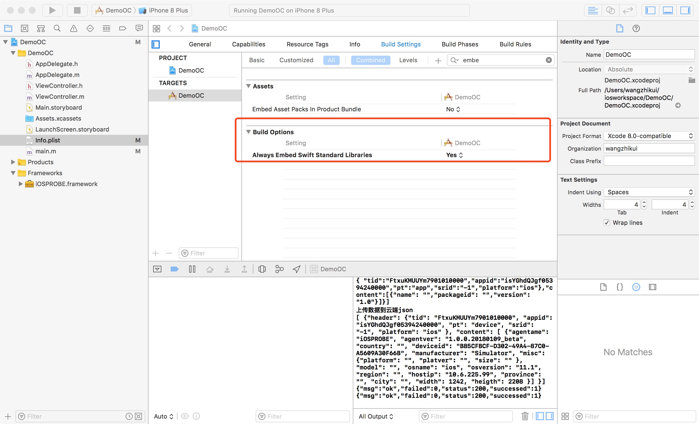
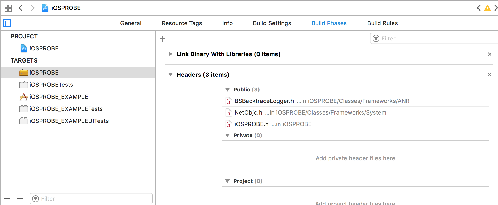

**[中文说明](README_CN.md)**  
# IOS PROBE
IOSPROBE is an app probe developed by swift to monitor the application data and send it to the server on a regular basis. Click to see the data you can collect.
**[(Click to view)](./README/METADATA.md)** 

## Installation

### 1.Download the source code
```git
git clone git@git.yonyou.com:wangzhk/iOSPROBE.git
```
### 2,Compile and packaged into iOSPROBE.FRAMEWORK
development environment  
```
Xode 9.1
Development target 10.0
swift language 3.2
OC
```
### 3,Import the package into the project
The debugging environment for EXAMPLE
```
simulator ios11.1
device iphone 6s  ios 10.3.3
```
### 4,Add the following code to the app entry method
Some parameters can be prefabricated here, such as the unique identification of the application, the check code tid. you can modify the source code according to your own needs.
Swift:
```swift
 YYY.openMonitor(tid:"tid",appid:"appid")
```
OC
```swift
 [YYY openMonitorWithTid:@"tid" appid:@"appid"];
```
### 5,Special note: the probe needs to obtain the location, it is suggested that the app can open this function. If the function is not turned on, it will affect the accuracy of the user's location.

Complete sample use SWIFT：   
```swift 
import UIKit
import iOSPROBE

@UIApplicationMain
class AppDelegate: UIResponder, UIApplicationDelegate {
    var window: UIWindow?
    func application(_ application: UIApplication, didFinishLaunchingWithOptions launchOptions: [UIApplicationLaunchOptionsKey: Any]?) -> Bool {
        YYY.openMonitor(tid:"FtxuKMUUYm7901013387",appid:"isYGhdQJgf0539424036&")
        return true
    }
}
```
Complete sample use OC：   
```swift 
#import <UIKit/UIKit.h>
#import "AppDelegate.h"
#import "iOSPROBE/iOSPROBE-Swift.h"
int main(int argc, char * argv[]) {
    [YYY openMonitorWithTid:@"FtxuKMUUYm7901010000" appid:@"isYGhdQJgf05394240000"];
    @autoreleasepool {
        return UIApplicationMain(argc, argv, nil, NSStringFromClass([AppDelegate class]));
    }
}
```
### 6,The probe is developed use swift, if your application use OC , the following Settings are required.


probe sometime use swift+OC,so you should add the .h file into heads   


## other
The probe sends the cloud interface format  
**[Click here view](./README/INTERFACE.md)**  
  