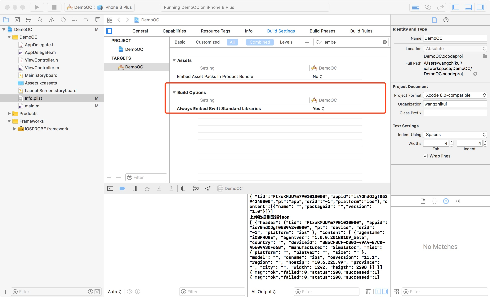

# IOS探针

## 说明
iOSPROBE是一个swift开发的app探针，用于监控应用的数据并定时发送到服务器端。能采集的数据字段信息见最后的说明（最终以源码为主）
* App信息
* 设备信息
* 网络请求信息
* 崩溃CRASH信息
* 卡顿ANR信息  

目前能采集以上几大类数据，其中每个app和设备信息会在app启动，初始化探针的时候发送的云端，请查看iOSPROBE.swift文件中的源码。其他三类采集的数据会在CoreDelegate.swift中发送，三个代理方法均在这里边处理，查看源码即可知道发送了什么数据。数据有两种方式，一种缓存后1分钟发送一次，一种是立即发送，根据自己需要修改。  

## 使用方法

### 1，下载源码
```git
git clone git@git.yonyou.com:wangzhk/iOSPROBE.git
```
### 2，编译打包成iOSPROBE.FRAMEWORK
开发环境
```
Xode 9.1
Development target 8.0
swift language 3.2
OC
```
### 3，将包重新签名后，引入工程中
示例程序调试环境
```
模拟器 ios11.1 iphone 8 plus
真机 iphone 6s  ios 10.3.3
```
### 4，在app入口方法处加入如下代码
此处可以预制一些参数，比如应用的唯一标识，appid，校验码token字段，tid等，可以根据自己需要修改源码
Swift:
```swift
 YYY.openMonitor(tid:"填入实际的tid",appid:"填入实际的appid")
```
OC
```swift
 [YYY openMonitorWithTid:@"填入实际的tid" appid:@"填入实际的appid"];
```
### 5，特别说明探针有获取位置的功能，建议app开启此功能。如不开启不影响功能正常使用，但会影响获取用户位置的准确度

swift完整示例：   
```swift 
import UIKit
import iOSPROBE

@UIApplicationMain
class AppDelegate: UIResponder, UIApplicationDelegate {
    var window: UIWindow?
    func application(_ application: UIApplication, didFinishLaunchingWithOptions launchOptions: [UIApplicationLaunchOptionsKey: Any]?) -> Bool {
        YYY.openMonitor(tid:"FtxuKMUUYm7901013387",appid:"isYGhdQJgf0539424036&")
        return true
    }
} 
```
OC完整示例：   
```swift 
#import <UIKit/UIKit.h>
#import "AppDelegate.h"
#import "iOSPROBE/iOSPROBE-Swift.h"
int main(int argc, char * argv[]) {
    [YYY openMonitorWithTid:@"FtxuKMUUYm7901010000" appid:@"isYGhdQJgf05394240000"];
    @autoreleasepool {
        return UIApplicationMain(argc, argv, nil, NSStringFromClass([AppDelegate class]));
    }
}
```
### 6，使用Objective-C开发的应用，因为本探针使用swift开发，所以需要将下面设置打开


## 编译过程说明
项目包含一个示例项目iOSPROBER_EXAMPLE，可使用该示例程序运行该工程测试  

swift+OC混编 桥接需要将三个oc的头文件添加到heads中如图：  


## 源码修改
探针默认是将采集到的数据直接print出来，如果需要发送的云端，需要改源码。  
iOSPROBE.swift文件，修改里边的配置信息，根据注释修改即可
```swift
 @objc open class func openMonitor(tid:String,appid:String) {
        //初始化租户id  tid 应用id appid
        BaseInfoTools.tid = tid
        BaseInfoTools.appid = appid
        //初始化发送云端服务器地址，host是在网络监控的时候用来判断获取到的url地址是不是我们自己的地址
        //探针发送数据到服务器的过程不需要监控
        NetworkTools.host = "www.wushuning.com"
        //云端接收数据的地址
        NetworkTools.url = "http://www.wushuning.com/send/api/mobile"
        //anr判定的阀值 传入2s
        BaseInfoTools.threadhold = 2.0
        //初始化探针版本和名称
        BaseInfoTools.agentName = "iOSPROBE"
        BaseInfoTools.agentVersion = "1.0.0.20180101_beta"
        //发送app和device数据到云端 探针启动的时候就发送，这里可以根据自己的需要修改！！！！！注意修改
        BaseInfoTools.sendAppInfo(tid: tid, appid: appid)
        BaseInfoTools.sendDeviceInfo(tid: tid, appid: appid)
        //        UITableView.open()
        //打开监控，首先判断是否可以发送数据，该标志位会在，每次发送数据到云端的返回信息中获取并更新
        if BaseInfoTools.isDataCanSend {
            CoreController.shared.openMonitor()
        }
    }
```
CoreDelegate.swift包含三个代理，查看方法的最后如下。加入缓存，直接发送，还是print查看，根据自己需要修改即可。如果要发送到云端，需要在上面的文件中配置相关的地址信息
```swift
//加入任务队列
//CacheTools.shared.setCacheForBusi(value: jsonStr, key: CacheTools.shared.NETWORK)
//直接发送请求
//NetworkTools.postCommon(jsonStr: jsonStr)
print(jsonStr)
```

## 感谢
本探针得得益于社区，部分框架代码直接使用的是开源项目，封装改造完善形成一个完整的监控探针分享给大家。开发过程也得到了github，cocoachina，简书，stackoverflow等社区上各大牛的指导。探针能基本满足日常的app监控，后续逐渐完善其他监控：如业务监控。也希望感兴趣的同仁联系我一起来完善

## 附接口格式
**[探针发送云端接口格式](./README/INTERFACE.md)**  
**[能采集的主要数据字段说明](./README/METADATA.md)** 

